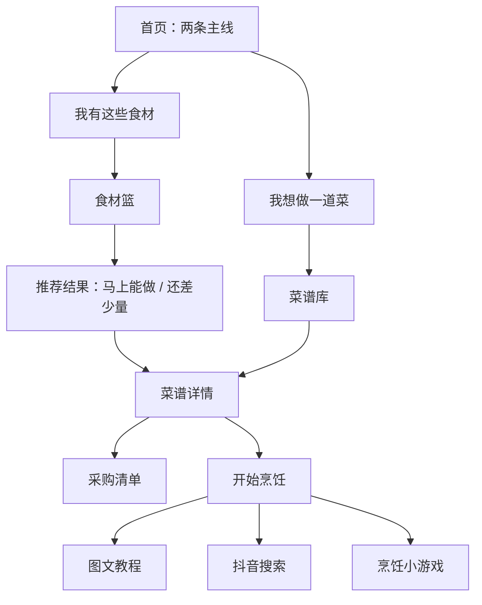

# 烟火有谱｜小程序最终产品开发指南

状态：产品方向基线  
适用范围：HTML Demo、后续 AI 增强、最终微信小程序  
变更原则：如果后续方案与本指南冲突，优先保留“两条绝对主线”和安全边界。

## 1. 产品定义

“烟火有谱”是一款面向厨房新手和日常做饭人群的智能菜谱产品。它解决的不是“怎样展示很多菜”，而是两个具体决策：

1. **根据食材选菜谱**：我家里现在有这些食材，能做什么，还缺什么？
2. **根据菜谱选食材**：我想做这道菜，需要准备什么，已经有什么，还要买什么？

产品的菜谱库、AI、像素素材、文化内容和烹饪教程都必须服务于这两条主线。用户应在三个主要操作以内得到“能不能做、缺什么、怎么做”的答案。

## 2. 用户与使用场景

核心用户：大学生、刚开始独立生活的职场新人、第一次系统学做饭的人。  
典型场景：

- 下班回家，冰箱里有几样东西，不知道做什么。
- 已经决定吃某道菜，但不确定买什么、买多少。
- 做到一半不知道下一步、火力或等待时间。
- 有过敏、忌口或特殊饮食需求，需要先看到明确提醒。

## 3. 最终信息架构

底部保留四个一级入口：

| 一级入口 | 作用 | 不应该承担的内容 |
|---|---|---|
| 首页 | 两条主线的起点、最近任务和少量推荐 | 不做 90 道菜的瀑布墙 |
| 菜谱 | 搜索、分类、筛选和菜谱发现 | 不做纯故事展览 |
| 食材篮 | 管理已有食材并发起匹配 | 不扩张成复杂冰箱保质期系统 |
| 我的 | 收藏、历史、采购清单、偏好与安全设置 | 不设置强制登录墙 |

最终产品可包含 11 类核心页面：首页、菜谱库、食材篮、我的、添加食材/AI 识别、推荐结果、菜谱详情、采购清单、开始烹饪、地域技艺故事、饮食设置。收藏和历史复用菜谱列表模板，不重复设计新页面。

## 4. 页面设计基线

### 4.1 首页

首屏只强调两个大入口：

- “我有这些食材｜看看现在能做什么”
- “我想吃一道菜｜看看需要准备什么”

首屏之后再放最近使用的食材、三道今日推荐、未完成采购清单、收藏和地域风味内容。不要用轮播图或大段策划文案压住主入口。

### 4.2 菜谱库

- 搜索支持菜名、主食材和菜系；未来再接自然语言。
- 筛选包含中餐/西餐/地域风味、时间、难度、主食材和饮食偏好。
- 卡片显示菜品照片、名称、时间、难度、匹配状态和安全提示图标。
- 列表不堆叠完整配料和步骤。

### 4.3 食材篮

- 使用像素食材图，支持搜索、分类、添加和删除。
- 分类以肉蛋、蔬菜、主食、调味、奶制品等为主。
- 数量不是匹配所必需时，可先用“已有/没有”；进入采购清单再处理克数和份量。
- 固定主按钮：“用这些食材找菜”。
- 后续 AI 入口包括自然语言、照片和语音，但识别结果必须由用户确认后才能加入食材篮。

### 4.4 推荐结果

分为三组：

- 马上能做：核心食材无缺失。
- 还差 1–2 样：明确列出缺少的关键食材。
- 换个灵感：匹配较弱，但符合时间、难度或口味偏好。

系统先排除明确的过敏原冲突，再按核心食材覆盖、缺失数量、时间和难度排序。对用户展示“能做/差几样”比展示模糊的 83 分更有用。

### 4.5 菜谱详情

必须包含：主图、菜名、菜系、用时、难度、份数、收藏、已有食材进度、配料分组、采购按钮、安全提醒、步骤预览和开始烹饪。

配料分为“已有”“需要购买”“可替换”。份数变化时用量同步变化。五道指定地域美食可进入故事页，但在官方名录与来源核验之前，界面使用“地域风味/技艺故事”，不要直接给所有菜统一加“非遗”徽章。

### 4.6 采购清单

- 按菜谱或食材类别分组。
- 相同食材合并，并保留来源菜谱。
- 支持勾选、恢复和清空已完成项。
- 已有食材默认不进入待买清单，用户可以手动恢复。
- 后续可分享或同步；基础体验必须在未登录状态可用。

### 4.7 开始烹饪

提供三个入口：图文教程、抖音搜索、烹饪小游戏。图文教程是稳定主入口，页面使用大字号、大按钮和高对比度，方便手湿或忙碌时操作。步骤包含当前序号、用时、低/中/高火力、涉及食材、计时器和上一步/下一步。

抖音入口只负责生成“菜名 + 家常做法”等搜索词并跳转或复制，不抓取、搬运、内嵌未经授权的视频。跳转失败时提供复制搜索词的降级操作。

### 4.8 烹饪小游戏

小游戏只内嵌在“开始烹饪”里，不做独立一级入口，不做关卡体系，也不设置奖惩或失败。

- 弱化洗切、切片、切丁等准备操作。
- 重点表现下锅后的顺序、等待、翻炒和出锅。
- 火力只有低、中、高三档。
- 到正确时机时提示并等待用户操作。
- 操作过早或选错时温和提醒，例如“还没到放葱花的时候，再等等”。
- 最终评分只用于鼓励，例如“节奏很稳，已经掌握这道菜的关键步骤”。

## 5. AI 能力边界

AI 不做独立底部栏目，也不放一个无目的的悬浮聊天球。它嵌入需要理解和解释的节点：

- 把“两个番茄、三个鸡蛋、半颗洋葱”解析为食材列表。
- 识别用户上传的食材照片并给出候选项和置信度。
- 用自然语言解释为什么推荐某道菜。
- 给出食材替换建议，并说明风味、口感或传统做法会发生什么变化。

食材标准化、菜谱匹配、份量计算、过敏原判断必须使用可检查的确定性规则。AI 不负责最终安全判断。没有网络或 AI 配置时，手动选择和本地匹配仍要完整可用。任何密钥只放在服务端或云函数环境变量中。

## 6. 过敏原、忌口与特殊人群食用提醒

统一使用这个名称，不使用“饮食安全诊断”等夸大说法。

- 过敏原规则从明确配料触发，并展示触发原因。
- 忌口支持不吃猪肉、不吃牛肉、素食等可配置项。
- 特殊人群提示采用克制措辞，不代替医生或营养师建议。
- 明确冲突的菜谱默认不进入“马上能做”；如果用户主动查看，先显示提醒。
- 不使用 AI 猜测过敏原。

## 7. 视觉与交互方向

视觉主题固定为“现代东方菜谱册 × 数字灶台”。

- 宣纸米白 `#F6F0E4`：主要背景。
- 烟墨深绿 `#173F36`：导航、标题和核心结构。
- 朱砂红 `#C6573C`：关键操作与提醒。
- 炉火金 `#E3A833`：火力、进度和温暖强调。
- 墨色 `#241F1A`：正文。

AI 菜品照片用于食欲和成果展示；像素食材用于选择、食材篮、采购清单和小游戏。不要在同一张小卡片里无规则混用实拍质感照片和像素图。

有记忆点的交互是：像素食材被选中后落入食材篮，点击“找菜”时出现短暂蒸汽，随后像菜谱纸条一样展开推荐结果。动效应短、克制，并尊重系统的“减少动态效果”设置。

## 8. 数据与技术原则

- 数据核心表：recipes、ingredients、recipeIngredients、steps、allergenRules、userPantry、shoppingList、preferences。
- 烹饪步骤字段至少包含 instruction、duration、heat、ingredientsUsed、timerRequired、gameAction、safetyNote，使图文教程和小游戏未来共用同一套步骤数据。
- 本地存储优先；登录只用于跨设备同步，不阻断首次使用。
- 90 张原图不应全量打包进首屏或一次性加载。列表用缩略图，详情图按需加载并缓存。
- 小程序版本通过数据仓库层、存储层、导航层和能力适配层替换浏览器实现，业务规则不重写。

## 9. 必须避免的设计

- 不新增独立 AI、小游戏或非遗底部栏目。
- 不在首页展示 90 道菜的照片墙。
- 不强制登录后才能找菜、看菜谱或生成清单。
- 不让 AI 判断过敏原或替代确定性匹配算法。
- 不把未核验的地方菜统一标成正式“非遗项目”。
- 不把 222 MB 原图一次性加载。
- 不把“功能入口存在”包装成“真实能力已经完成”。

